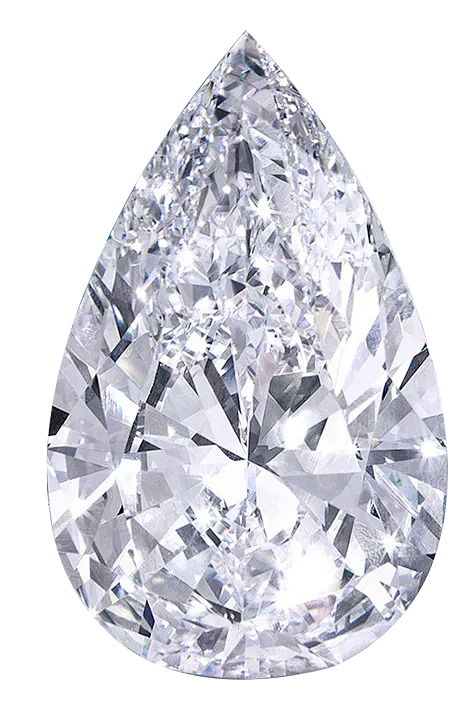

<!DOCTYPE html>
<html>
<head>
    <meta charset="UTF-8">
    <meta name="viewport" content="width=device-width, initial-scale=1.0, maximum-scale=1.0, user-scalable=no">
    <title>手機鑽石貼紙</title>
    
</head>
<body>
    <input type="file" id="upload" accept="image/*" style="margin-bottom:10px;">
     
    <canvas id="canvas"></canvas>
    
    

        
        
        
    

    
</body>
</html>
# decodeco-
